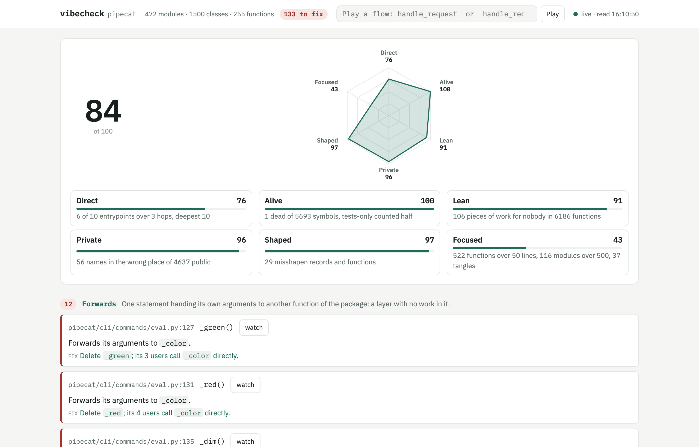
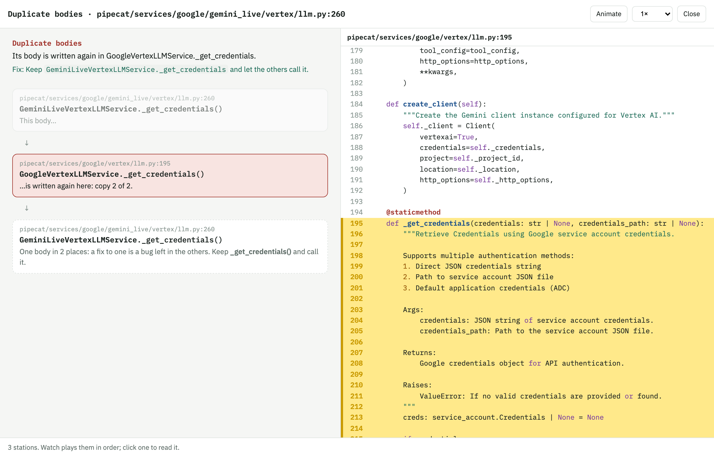
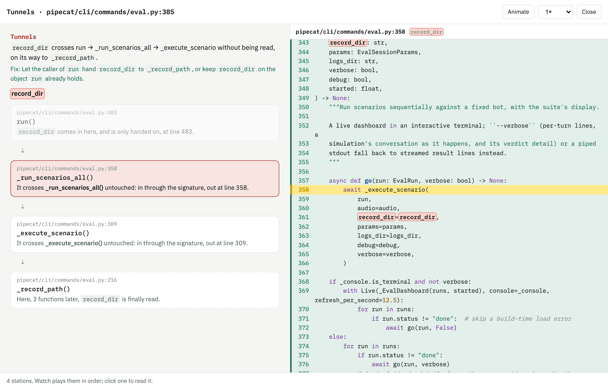
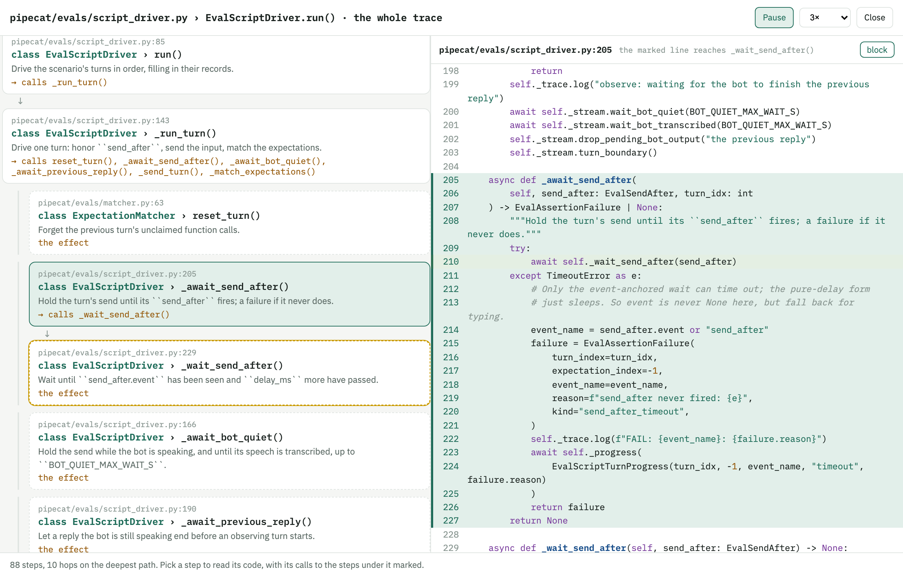

# vibesmell

**The smells a linter can't see, because they live between files.** vibesmell reads a Python
package or a TypeScript project whole, resolves who calls what down to the method, and reports
the indirection and the work for nobody that code written fast leaves behind: functions that only
forward, parameters carried through three functions unread, the same body written twice, values
every caller drops, import cycles, modules everyone imports for two names out of forty. Each finding
says what is wrong and how to fix it, and most of them can be *watched*: the page walks you through
the issue in the code, station by station.

No baseline file, no history file, nothing generated. A finding is fixed, or the check that made it
is. Standard library only for Python; TypeScript needs `node`.



## Try it

```
uvx --from vibesmell vibesmell score    # six attributes from 0 to 100
uvx --from vibesmell vibesmell check    # every finding; exit 1 when there is one
uvx --from vibesmell vibesmell serve    # the page, at http://127.0.0.1:8765
```

Run it in a project: it finds the one package under the current directory (or `src/` beside a
`tsconfig.json`), or name it: `vibesmell check src/mypkg`. Or install it for good:
`uv tool install vibesmell` (or `pipx install vibesmell`).

## What it looks like: pipecat

[pipecat](https://github.com/pipecat-ai/pipecat), the open-source framework for voice and multimodal
agents, read as a library (`vibesmell serve src/pipecat --library`, every public name a door, since the
code that calls it lives in its users' projects): 472 modules, 6186 functions, 5693 symbols, read in
about twelve seconds. It scores **84**. Almost nothing is dead, and little work is done for nobody;
what pulls the score down is size, Focused at 43: 522 functions over 50 lines and 116 modules over
500. The findings worth a look are the 38 bodies written twice across providers.

Every duplicate can be watched, each copy whole, one after the other: here, the same
`_get_credentials` in the Gemini Live Vertex service and in the Vertex LLM service.



A tunnel: `record_dir` enters the eval command's `run`, crosses `_run_scenarios_all` and
`_execute_scenario` without either reading it, and is read three functions later, in `_record_path`.



And every entrypoint's whole trace, animated the way the code reads: each body down to the call
that leads on, into it, and back for the next.



A score is read from one commit of pipecat, on the day of the screenshots; run it yourself for today's.

## The page

`vibesmell serve` shows one column: the score, every finding under its check's note, and the doors,
every entrypoint deepest first. Click a door to read its whole trace, step by step, with the code of
each step beside it; **Animate** reads the trace the way the code reads. Click any function for who
uses it, what it calls (a tree opened box by box) and every door that reaches it. The page reads the
package again every time a file of it changes.

## The checks

Every check looks across files. A linter reads one file at a time, so none of these are a
linter's. Each one is meant to be right nearly every time, and each note below says what it
leaves alone on purpose.

| check | the note | the fix |
|---|---|---|
| `dead` | Nothing in the package or its tests names the symbol. A name read anywhere, by any receiver, counts as alive; so does a decorator, and `main`. | Delete it. |
| `forward` | The whole body is one call handing every parameter on to another function of the package: a layer with no work in it. A function that drops or reshapes an argument is an adapter and is left alone. | Delete it; its callers call the target. |
| `tunnel` | A parameter crosses three or more functions without any of them reading it, only handing it on. Reported once, where it enters; one value carried to one place by many ways in is one tunnel, told once with the count of ways. | The first function hands it to the last, or keeps it on an object it already holds. |
| `private_abroad` | A `_name` is used from a module that is not its own. | Drop the underscore, or move it next to its users. |
| `bool_flag` | A bool parameter is tested by the first statement of the body, and some caller in the package sets it with a literal `True` or `False`: that caller is choosing a mode, and there are two functions in one. A caller handing a variable it holds is passing a fact, and is left alone. | Split it into two functions, one per branch. |
| `cycle` | Two or more modules import each other. A lazy import inside a function counts: that is where a cycle hides. Reported once per ring. | Move what the second needs of the first below both, or merge them. |
| `layer` | A module of one folder imports a folder above it in `layers`. | Move what it needs down, or hand it in from above. |
| `forbid` | A module imports a name its folder may not, of the package or from outside (`httpx` in `domain/`). | Take the import out, or the name out of the rule. |
| `clump` | Three or more parameters are handed on together, by name, from function to function, through three or more functions, and at least one function in the middle only relays them. Sharing a signature is not enough: route handlers all take the same doors. | Make them one object and hand that on. |
| `constant_param` | Every caller in the package passes the same literal for a parameter. Only functions whose name is unique in the package are checked, so a call is never mistaken for another's. | Drop the parameter and use the value inside. |
| `hub` | A module imported by ten or more modules, importing ten or more, with ten or more public names, whose importers each use a fifth of them or less: several modules in one, and every importer drags all of its imports. A foundation everyone imports but that imports nothing is left alone. | Split it along what its importers use. |
| `tests_only` | The package never names the symbol; only its tests do. | Delete it and its test, or give it the caller it waits for. |
| `home_only_public` | A public function only its own module calls. A test importing it, or a framework it is handed to as a value (`Depends(f)`, `set_defaults(run=f)`), both need it public, and are left alone. | Rename it `_name`. |
| `unread_field` | A field of the package's own record that no code reads as `.name`, matches as `case Cls(name=...)`, or reads whole (`asdict`, `vars`, `model_dump` in its module). A class with a library base is a contract and is left alone. | Drop the field. |
| `twin_shapes` | Two records of the package's own, in one folder, with the same fields. A class with a library base is a contract with the outside; a class in a dict, list or tuple, or matched by `case Cls(...)`, is a tag told apart by name: both are left alone. | Keep one of them. |
| `duplicate` | Two or more functions with one body: the same syntax tree once every local is renamed by where it first appears, and the docstring dropped. Bodies under 40 nodes are left alone: two small ones alike are a pattern, not a copy. The first copy AI-written code leaves, by far. | Keep one and let the others call it. |
| `ignored_return` | A function that returns a value (not `None`, not `self`), and every call of it, in the package and its tests, is a statement that lets the value go. Only functions whose name is unique, that are not handed on as values, not decorated and not a library's hook. | Return nothing, or use what it returns. |
| `unused_default` | A parameter with a default that no call, in the package or its tests, ever gives: generality nobody asked for. A call that spreads `*args` or `**kwargs` stops it. | Drop it and use the default inside. |
| `unused_param` | A parameter the body never reads, of a function ours alone to change: unique name, not handed on, not decorated, not a library's hook, not a stub, with at least one call in sight (without one it may be a callback whose signature is set elsewhere). | Drop it here and from every call. |
| `scattered_api` | A library function called raw, inside function bodies, from five modules or more in two folders or more. The standard library, the package itself, a module's setup (`getLogger`, `Field`…), an exception raised and a value built to be returned are left alone. | Put it behind one function of ours. |
| `unstable_dependency` | A module five or more import, leaning on one at least 0.4 more unstable (Martin's instability: imports over imports plus importers). | Move what it needs down, or turn the dependency around. |
| `feature_envy` | A method reading four or more attributes of one parameter, and more than twice its own, when that parameter is annotated with a class of ours that has methods: reading a record's fields is what records are for. | Move it to that class, or give that class the method. |
| `single_implementation` | An abstract class of ours (an `ABC` base, or an `abstractmethod`) that exactly one class of ours implements. | Fold it into its implementation until a second exists. |
| `shotgun` | Two files in different folders that git commits together five times or more, and in three quarters or more of the rarer one's commits. Read from the last 1000 commits, skipping sweeps of more than 20 files; nothing without git. | Put them together, or cut the seam they share. |

## The score

Six attributes from 0 to 100, like a player card, and their average. Each counts one family of
findings against the size of the package, and nothing is stored: run it at any commit and you
get that commit's score.

| attribute | what it counts |
|---|---|
| Direct | entrypoints whose longest chain of the package's own calls runs over 3 hops before reaching a sink |
| Alive | dead symbols, and those only the tests use (counted half) |
| Lean | forwards, tunnels, duplicates, ignored returns, unused parameters and defaults: work for nobody |
| Private | private names used abroad, and public ones used only at home |
| Shaped | boolean flags, twin shapes, unread fields, clumps, feature envy, single implementations |
| Focused | functions over 50 lines, modules over 500, and tangles: hubs, cycles, shotgun, scattered calls, unstable dependencies |

## Play a flow

```
vibesmell play handle_request                          # everything under one function, animated
vibesmell play handle_request open_session Log.append  # one flow: from the first, through the second, to the last
vibesmell play handle_request open_session Log.append --text   # the same as lines, for a terminal or an agent
```

Any function of the package, not only a door: `handle_request`, `Store.append`, or `log.store:Store.append`
when the name is not unique. With two or more names the page keeps the whole tree under the first
one, as a door's trace does, marks on it the path through each name in order (the shortest chain of
the package's own calls), and animates only that path. The page must be up: `play` talks to it, and starts it (and opens the
browser) when it is not. The link it prints reproduces the flow, `#play=a>b>c`, so it can be sent.
This is the path the code allows, read from the source; it is not a trace of one run.

```
vibesmell reach Log.append     # every entrypoint that reaches a function, shortest chain first
```

On the page, a function's panel lists the same doors, each one a click from playing its flow, and
every step of a flow that carries a finding (its own, or a tunnel or clump running through it) is
flagged with ⚑ and the check's name.

Eighteen findings have their own animation, a watch button instead of play, that tells the issue in
the code station by station, its names marked in colour:

- a **tunnel**: the parameter comes in, crosses each function untouched (in through the signature, out
  on one line), and is finally read, functions later;
- a **data clump**: the group, each name its own colour, going together through every signature and
  every call, in the order the calls go;
- a **constant parameter**: each call site in turn passing the same literal, then the function where
  the parameter is always that;
- a **forward**: each caller calling it, the forward handing everything on, and the function where
  the work is;
- a **hub**: every importer at its import line, the few names it takes out of all the hub has,
  fewest first;
- a **cycle**: each module of the ring at the line that imports the next, saying so when that
  import sits inside a function (a lazy import hides a cycle until it runs);
- **used by tests only**: the definition, the test file's import, then each test that uses it;
- **public, used at home only**: the function, then every call of it, all in its own file;
- a **boolean flag**: the `if` that splits the function, then each caller picking a side with a literal;
- **shotgun surgery**: the two files, then each commit that had to touch both, with what it changed in
  each (read from git, `git show` of that commit and file);
- a **duplicate**: each copy, whole, one after the other;
- an **ignored return**, a **default nobody overrides**, an **unused parameter**: the function, then each
  call dropping the value, taking the default, or handing over what is never read;
- a **scattered library call**: each module calling it raw;
- an **unstable dependency**: who leans on the module, what it leans on, and how much that moves;
- **feature envy**: the method, then the class whose data it keeps reading;
- a **single implementation**: the abstract class, then the only class there is.

The page plays flows too: type `handle_request` or `handle_request > open_session > Log.append` in the box at
the top. Every finding about a function has a play button: a tunnel or a forward plays the chain
it describes, the rest play everything under the function.

## How it reads a package

A reader turns a language's syntax into facts, and the checks read only the facts
(`vibesmell/facts.py`): each call (its name, where, what it gives for each argument, whether its
value is kept), each function (its parameters and defaults, which it reads and which it only hands
on, whether its body is one call, whether it starts by testing a flag, the shape of its body), each
class (its fields, its bases, whether one is a library's), and the module imports. Python's reader
is `python_facts.py` beside `graph.py`; a reader for another language fills the same facts and every
check, the score and the page work unchanged.

**TypeScript** is read by `vibesmell/ts/reader.cjs`, with TypeScript's own compiler and checker, so
`x.m()` reaches the method `m` of the type `x` has instead of a guess. It needs `node`; the first
run installs TypeScript 6 beside the reader (TypeScript 7, the Go compiler, has no API until 7.1).
A folder is TypeScript when it has no `__init__.py`, holds `.ts` files and has a `tsconfig.json`
above it; run from a project with a `tsconfig.json` and a `src/`, `vibesmell check` reads `src/`.

What changes with the language:

- **Doors** are what `package.json`'s `main` and `exports` export, and the public methods of an
  exported class: whoever imports the package calls them.
- **Private** is not exported (or a `private`/`#` member). `home_only_public` says "stop exporting";
  `private_abroad` cannot happen, since what is not exported cannot be imported.
- **Imports of types alone** (`import type`) are left out of the module graph: they are gone once
  compiled, and close no cycle.
- **Returns** are read from the checker's return type: `void`, `undefined`, `never` and
  `Promise<void>` return nothing, and `this` is a fluent interface.
- **Tests** are the files under `test/`, `tests/` or `__tests__/`, and any `*.test.ts` or `*.spec.ts`.
- **Rules** go under a `vibesmell` key in `package.json`, with the same names as `[tool.vibesmell]`.

## The rules of a project

Everything a project says lives in `pyproject.toml`, under `[tool.vibesmell]`. None of it is
required.

```toml
[tool.vibesmell]
# Where the world comes in, beyond routed functions and [project.scripts]: never dead, the hops start here.
entries = ["process_frame"]
# Symbols never reported dead: a plugin hook, a name exported for others.
keep = ["Settings"]
# A library: every public name is a door, since the code that calls it lives in its users' projects.
library = false
# Functions whose call is the effect: the hops stop there.
sinks = ["Log.append", "Mailer.send"]
# Folders from the bottom up: one may import only from those before it.
layers = ["domain", "store", "service", "api"]

# What a folder may not import, of the package or from outside.
[tool.vibesmell.forbid]
domain = ["httpx", "asyncpg", "myapp.api"]

# What a folder is excused from. The why is required, and printed every run: a skip is never silent.
[[tool.vibesmell.skip]]
path = "myapp/wire/**"
checks = ["forward"]
why = "the wire mirrors the domain on purpose"
```

What there is not: a way to accept one finding by its id. That is a baseline with another name.

## For an agent

```
vibesmell summary          # the whole report as Markdown: score, every finding under its check's note, skips, deepest doors
vibesmell check --json     # the findings and what the skips hid, as one object
vibesmell score --json     # the six attributes
```

## The Claude Code hook

```
vibesmell install-hook             # in ~/.claude/settings.json, every project
vibesmell install-hook --project   # in ./.claude/settings.json, this one
vibesmell install-hook --dir ~/.claude-work
vibesmell uninstall-hook           # the same flags; takes out only this hook
```

After every save of a Python or TypeScript file (Edit, Write, MultiEdit), Claude Code hears what vibesmell
finds in that file: the new findings, each with its fix, and what the save fixed. It only talks:
the file is saved, nothing is blocked, and a file that does not parse yet is left alone. What was
already said about a file is not said again. There is no Stop hook.

## License

MIT.
